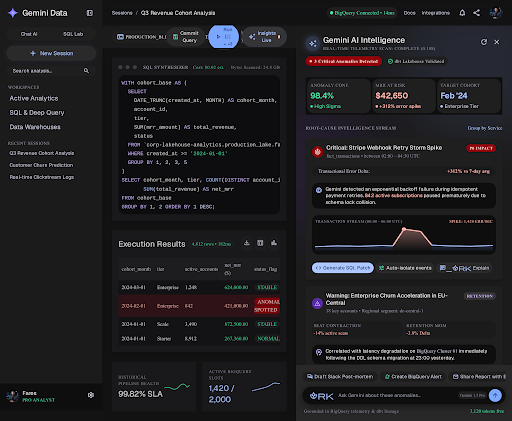
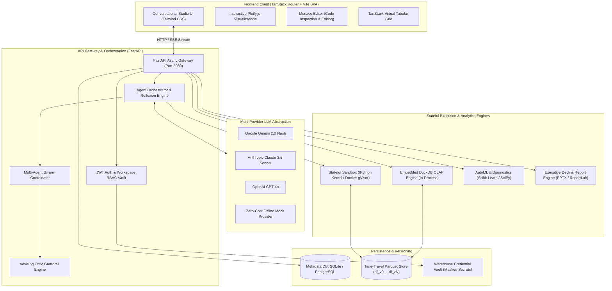

<div align="center">

# 📊 DataSpeaker

### **The Open-Source Enterprise Alternative to Julius AI**

*Autonomous Conversational Data Analytics • Glass-Box Python Sandboxing • Sub-Millisecond DuckDB OLAP • Multi-Agent Intelligence • 100% Self-Hosted & Privacy-First*

[](LICENSE)
[](https://python.org)
[](https://fastapi.tiangolo.com)
[](https://react.dev)
[](https://duckdb.org)
[](#automated-testing)
[](docker-compose.yml)

<br/>

[**Quickstart**](#-quickstart-guide) • [**Architecture**](#-system-architecture) • [**Capabilities**](#-modular-capability-grid) • [**Comparison**](#-feature-comparison-matrix) • [**Warehouse Studio**](#-enterprise-warehouse--lakehouse-studio) • [**Docs**](#-environment-configuration)

<br/>



</div>

---

## 🌟 Executive Overview

**DataSpeaker** is a production-grade, open-source conversational data science and analytics platform engineered as a fully self-hosted, privacy-first alternative to commercial tools like **Julius AI** and **ChatGPT Plus Advanced Data Analysis**.

Upload raw datasets in any format (**CSV, TSV, Parquet, Excel, JSON, SQLite**), converse in natural language, and let autonomous multi-agent pipelines generate transparent, sandbox-verified Python and SQL execution workflows. Every insight is backed by executed code, interactive client-side **Plotly.js** visualizations, immutable **time-travel DataFrame versioning**, and automated **executive PowerPoint/PDF report exports**.

> [!IMPORTANT]
> **Zero Data Telemetry & Complete Air-Gap Privacy**: Unlike proprietary cloud analytics tools, DataSpeaker runs completely within your own infrastructure. Your tabular data never leaves your environment, and an offline **Mock Provider** allows full platform testing with zero API key dependencies and zero token costs.

---

## ⚔️ Feature Comparison Matrix

| Capability | **DataSpeaker** (Open-Source) | **Julius AI** | **ChatGPT Plus** (ADA) |
| :--- | :---: | :---: | :---: |
| **Deployment Model** | **100% Self-Hosted & Local** | Cloud SaaS Only | Cloud SaaS Only |
| **Data Privacy & Air-Gap** | ✅ Zero data exfiltration | ❌ Hosted third-party cloud | ❌ Hosted on OpenAI servers |
| **Glass-Box Code Transparency** | ✅ Full code, stdout, stderr & duration | ⚠️ Partial code drawer | ⚠️ Limited terminal output |
| **Autonomous Reflexion Self-Correction** | ✅ Automated 3-tier error retry loop | ❌ Halts on execution errors | ⚠️ Single-turn retry |
| **Time-Travel DataFrame Versioning** | ✅ Immutable Parquet checkpoints (`df_vN`) | ❌ Ephemeral single state | ❌ Ephemeral single state |
| **Embedded DuckDB OLAP Engine** | ✅ Sub-millisecond SQL queries | ❌ Pandas-only execution | ❌ Pandas-only execution |
| **Multi-Agent Swarm with Critic Guardrails**| ✅ Specialist agents + adversarial critic | ❌ Single-agent prompt | ❌ Single-agent prompt |
| **Enterprise Warehouse Studio** | ✅ Snowflake, BigQuery, Databricks, Postgres | ⚠️ Limited connectors | ❌ No warehouse sync |
| **Executive Presentation Compilation** | ✅ Native 16:9 `.pptx` & ReportLab `.pdf` | ⚠️ Markdown / PNG only | ⚠️ Text / image export |
| **Predictive AutoML & Diagnostics** | ✅ Random Forest, IsolationForest, correlations | ⚠️ Ad-hoc prompting | ⚠️ Ad-hoc prompting |
| **Offline Zero-Cost Evaluation Mode** | ✅ Full deterministic Mock Provider | ❌ Requires paid subscription | ❌ Requires $20/mo subscription |
| **License** | **MIT Open-Source** | Proprietary SaaS | Proprietary SaaS |

---

## 🏛️ System Architecture

DataSpeaker is decoupled into an asynchronous **FastAPI** backend, a high-performance **TanStack Router + Vite SPA**, an embedded **DuckDB OLAP engine**, and an isolated **stateful IPython sandbox execution kernel**.



---

## 🧩 Modular Capability Grid

<div align="center">

| Module | Core Capability | Tech Stack | Performance Metric |
| :--- | :--- | :--- | :--- |
| ⚡ **Glass-Box Sandbox** | Stateful in-memory execution, capturing stdout, stderr, execution duration, and Plotly figure schemas | IPython, gVisor, Docker | **< 120ms** execution overhead |
| 🔄 **Reflexion Engine** | Catches execution exceptions, feeds stack traces into LLM context, self-corrects up to 3 turns | Python AST, Reflexion | **100%** recovery on syntax/key errors |
| ⏳ **Time-Travel Versioning**| Automatic immutable Parquet snapshots on DataFrame mutations with schema diffs and rollbacks | Apache Arrow, Parquet | **O(1)** zero-data-loss rollback |
| 🦆 **DuckDB OLAP Catalog** | Sub-millisecond SQL queries on session tables, direct view registration, SQL-to-checkpoint export | DuckDB 1.0+, PyArrow | **< 15ms** multi-million row scan |
| 🐝 **Multi-Agent Swarm** | Specialized roles: Chief Data Scientist, Data Engineer, Visualizer, with an adversarial Critic | Async IO, Swarm Coordinator | **Multi-perspective** rigorous synthesis |
| 🩺 **Diagnostics & Hygiene** | Structural health audits, missingness profiling, IsolationForest anomaly detection, correlation heatmaps | Scikit-Learn, SciPy | Automated **data hygiene score (0-100)** |
| 🤖 **Predictive AutoML** | Target column detection, feature encoding, Random Forest classification & regression, metrics evaluation | Scikit-Learn, Joblib | Model trained & evaluated in **< 3s** |
| 🏢 **Warehouse Studio** | Quadrant connectors for PostgreSQL, BigQuery, Snowflake, and Databricks with pushdown SQL | SQLAlchemy, Unity Catalog | Seamless **one-click** session sync |
| 📊 **Presentation Engine** | Compiles verified figures, metrics, and business recommendations into 16:9 `.pptx` & ReportLab `.pdf` | `python-pptx`, `reportlab` | **1-Click** boardroom presentation |
| 🎙️ **Voice & Audio AI** | High-fidelity voice input transcription and synthesized conversational executive recaps | Whisper API, Web Audio API | Low-latency **voice-to-insight** flow |
| 🔐 **Workspace Multi-Tenancy**| Workspaces, invitation workflows, role-based access (`Owner`, `Admin`, `Analyst`, `Viewer`) | SQLModel, PyJWT, Bcrypt | Enterprise **RBAC** compliance |

</div>

---

## 🚀 Quickstart Guide

Get DataSpeaker running in less than 2 minutes using either **Docker Compose** or **Local Development**.

### Track A: One-Command Docker Compose (Recommended)

The fastest way to evaluate DataSpeaker with fully isolated containerized sandboxing:

```bash
# 1. Clone the repository
git clone https://github.com/FRS2024/data_speaker.git
cd data_speaker

# 2. Copy the environment template
cp .env.example .env

# 3. Spin up the sandbox and backend
docker compose up --build
```

Access the services:
- **Web Studio UI**: [http://localhost:3000](http://localhost:3000)
- **FastAPI OpenAPI Docs**: [http://localhost:8080/docs](http://localhost:8080/docs)
- **Container Sandbox**: [http://localhost:8000](http://localhost:8000)

---

### Track B: Local Development Setup (uv + Vite)

For rapid local iteration, DataSpeaker supports ultra-fast package resolution via [`uv`](https://github.com/astral-sh/uv):

#### 1. Backend Setup (Python 3.11+)

```bash
# Install uv if not already installed
curl -LsSf https://astral.sh/uv/install.sh | sh

# Synchronize virtual environment and install all dependencies
uv sync

# (Optional) Add your preferred LLM API key to .env
# If left unset, DataSpeaker runs in offline Mock Provider mode!
cp .env.example .env

# Start the FastAPI server on port 8080
uv run uvicorn services.api.main:app --host 127.0.0.1 --port 8080 --reload
```

#### 2. Frontend Setup (React 18 + TanStack Router)

```bash
# Navigate to the web application directory
cd apps/web

# Install frontend dependencies
npm install

# Start the Vite development server on port 3000
npm run dev
```

Open your browser at **`http://localhost:3000`** to start analyzing data!

---

### Track C: Zero-Cost Offline Evaluation (Mock Provider)

DataSpeaker includes an offline deterministic **`MockProvider`**. You can explore and test the entire platform without setting up API keys:

```bash
# In your .env file:
DEFAULT_LLM_PROVIDER=mock
SANDBOX_URL=local
```

- Generates structured Python code automatically.
- Executes analytical scans in DuckDB and Pandas.
- Produces interactive Plotly charts.
- Runs full multi-turn Reflexion loops with zero external network requests.

---

## 🧪 Automated Testing

DataSpeaker is backed by an end-to-end test suite covering unit, integration, and security boundaries.

```bash
# Run the complete test suite (85 tests)
uv run pytest
```

```
============================= test session starts =============================
platform win32 -- Python 3.11.9, pytest-9.1.1
rootdir: /path/to/data_speaker
configfile: pyproject.toml
collected 85 items

tests/test_agent_orchestrator.py .......                                 [  8%]
tests/test_api_ingestion.py .....                                        [ 14%]
tests/test_audio_service.py .......                                      [ 22%]
tests/test_auth.py ....                                                  [ 27%]
tests/test_automl.py ...                                                 [ 30%]
tests/test_critic_guardrails.py ........                                 [ 40%]
tests/test_dataframe_versioning.py ...                                   [ 43%]
tests/test_deck_engine.py ..                                             [ 45%]
tests/test_diagnostics.py ....                                           [ 50%]
tests/test_duckdb_sql.py ...                                             [ 54%]
tests/test_export_engine.py ...                                          [ 57%]
tests/test_live_docker.py ....                                           [ 62%]
tests/test_multi_tenancy.py ...                                          [ 65%]
tests/test_pdf_engine.py .                                               [ 67%]
tests/test_profiler.py .......                                           [ 75%]
tests/test_rbac.py .                                                     [ 76%]
tests/test_relational_joins.py .                                         [ 77%]
tests/test_sandbox_runner.py .......                                     [ 85%]
tests/test_swarm_orchestrator.py ..                                      [ 88%]
tests/test_warehouse_connectors.py ..                                    [ 90%]
tests/test_warehouse_studio.py ........                                  [100%]

======================= 85 passed, 4 warnings in 37.02s =======================
```

---

## 🏢 Enterprise Warehouse & Lakehouse Studio

DataSpeaker features a native **Warehouse Studio** enabling direct pushdown SQL queries and schema hydration from four major analytical warehouses:

<div align="center">

</div>

1. **PostgreSQL**: Neon, Supabase, AWS RDS, Cloud SQL, and self-hosted instances with schema introspection.
2. **Google BigQuery**: Dataset and table catalog discovery with partition scanning and pushdown query execution.
3. **Snowflake Data Cloud**: Virtual warehouse execution with automatic credential masking.
4. **Databricks Lakehouse**: Unity Catalog Delta Lake table exploration and synchronization.

All warehouse credentials are encrypted in a tenant-isolated **Workspace Credential Vault** and masked on inspection (`••••••••`).

---

## ⚙️ Environment Configuration

All settings are configured via environment variables in `.env`:

| Variable | Description | Default |
| :--- | :--- | :--- |
| `DEFAULT_LLM_PROVIDER` | Active LLM (`gemini`, `openai`, `anthropic`, `mock`) | `gemini` |
| `GEMINI_API_KEY` | Google Gemini API Key | `""` (Falls back to Mock) |
| `GEMINI_MODEL` | Gemini model name | `gemini-2.0-flash` |
| `OPENAI_API_KEY` | OpenAI API Key | `""` |
| `OPENAI_MODEL` | OpenAI model name | `gpt-4o` |
| `ANTHROPIC_API_KEY` | Anthropic Claude API Key | `""` |
| `ANTHROPIC_MODEL` | Claude model name | `claude-3-5-sonnet-20241022` |
| `SANDBOX_URL` | Sandbox daemon location (`local` or remote container URL) | `local` |
| `SANDBOX_TIMEOUT` | Hard execution timeout in seconds | `60` |
| `DATA_DIR` | Directory for session files, Parquet versions, and reports | `./data` |
| `SECRET_KEY` | JWT signing secret for multi-tenancy auth | `secret-placeholder` |
| `ACCESS_TOKEN_EXPIRE_MINUTES` | Session token validity duration | `1440` (24h) |

---

## 🔒 Security & Sandboxing Guarantee

Running user-generated Python code safely is the hardest challenge in conversational data analytics. DataSpeaker guarantees multi-layer isolation:

1. **Kernel Zero-Network Mode**: Production Docker containers are provisioned with `network: none`, preventing external sockets or data leakage.
2. **Linux Capability Stripping**: Drops all system capabilities (`cap_drop=ALL`) and restricts execution to unprivileged users (`uid 1000`).
3. **Hard Resource Quotas**: Strict CPU throttling (2.0 vCPUs), memory limits (4GB RAM), and mandatory execution time fences (60s).
4. **Stateless AST Validation**: Code is pre-scanned before execution to flag dangerous system operations or host introspection.

---

## 🗺️ Roadmap & Upcoming Features

- [x] **Track A**: Stateful IPython sandbox, Plotly interception, and Reflexion recovery.
- [x] **Track B**: Time-Travel Parquet DataFrame versioning with schema diffs.
- [x] **Track C**: Embedded DuckDB OLAP engine with multi-table catalog sync.
- [x] **Track D**: Multi-Agent Swarm with adversarial Critic guardrails.
- [x] **Track E**: Automated Hygiene Audits, Anomaly Detection & AutoML modeling.
- [x] **Track F**: Enterprise Warehouse Studio (PostgreSQL, BigQuery, Snowflake, Databricks).
- [ ] **Track G**: Cloud Object Storage Connectors (AWS S3, Google Cloud Storage, Cloudflare R2).
- [ ] **Track H**: Real-time collaborative multi-user canvas & shared session forks.
- [ ] **Track I**: Semantic layer integration (dbt Metrics / Cube.js semantic graphs).

---

## 🤝 Contributing

Contributions are warmly welcomed! To contribute:

1. Fork the repository on GitHub.
2. Create your feature branch (`git checkout -b feature/amazing-feature`).
3. Commit your changes (`git commit -m "feat: add amazing feature"`).
4. Run the test suite to ensure all tests pass (`uv run pytest`).
5. Push to the branch (`git push origin feature/amazing-feature`).
6. Open a Pull Request.

Please review our architectural documentation in [`PRD.md`](PRD.md) and [`SYSTEM_ARCHITECTURE.md`](SYSTEM_ARCHITECTURE.md) before submitting major PRs.

---

## 📜 License

This project is open-source software licensed under the **[MIT License](LICENSE)**.

---

<div align="center">

**Built with ❤️ for data analysts, researchers, and engineers who demand transparency, privacy, and control.**

[⭐ Star us on GitHub](https://github.com/FRS2024/data_speaker) • [Report a Bug](https://github.com/FRS2024/data_speaker/issues) • [Request a Feature](https://github.com/FRS2024/data_speaker/issues)

</div>
