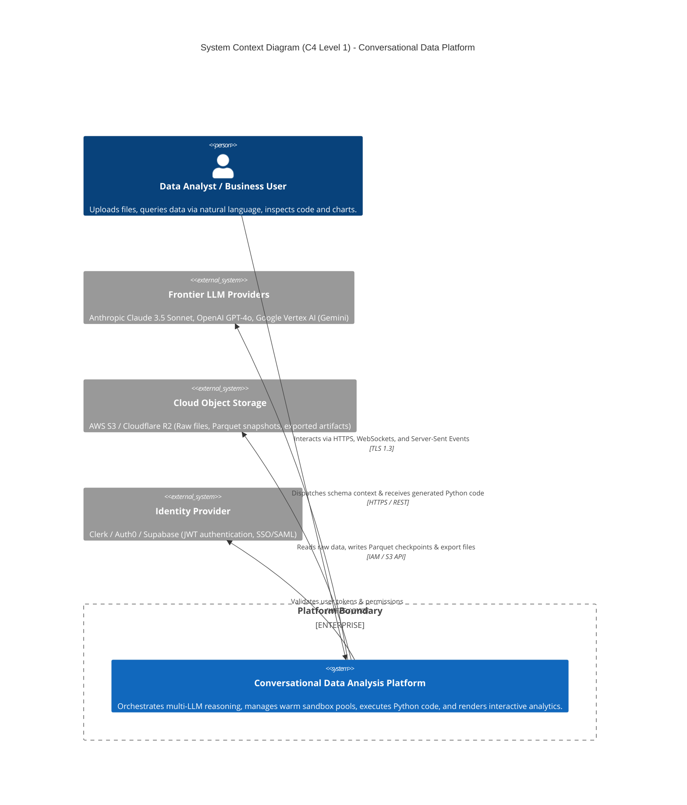
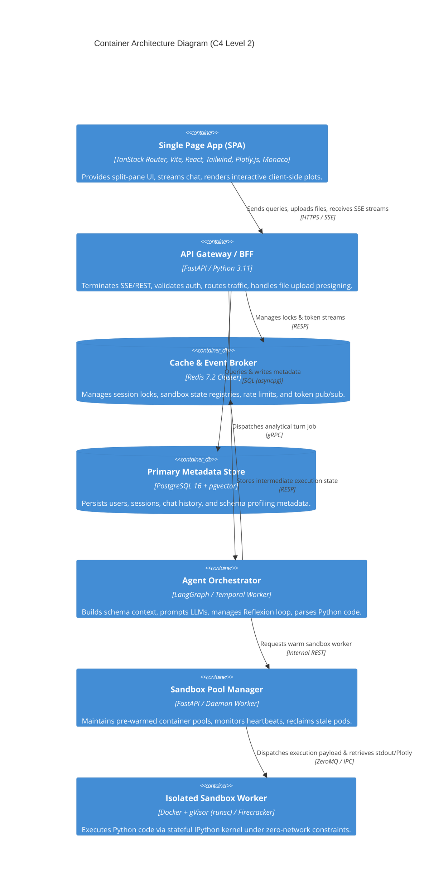
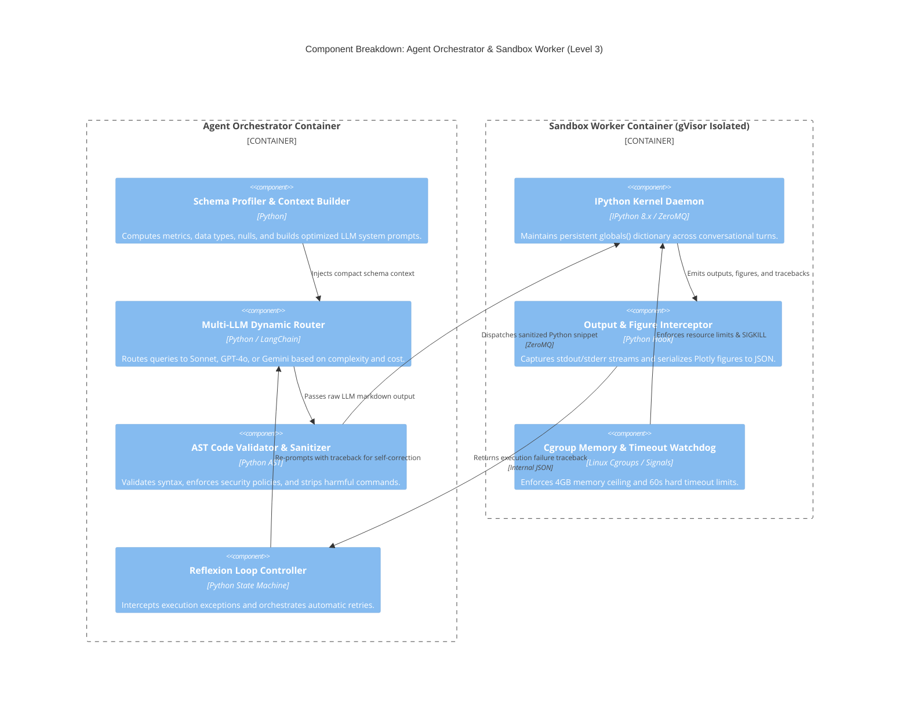
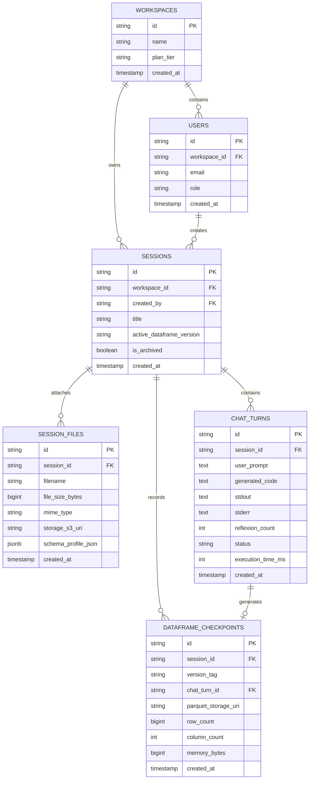
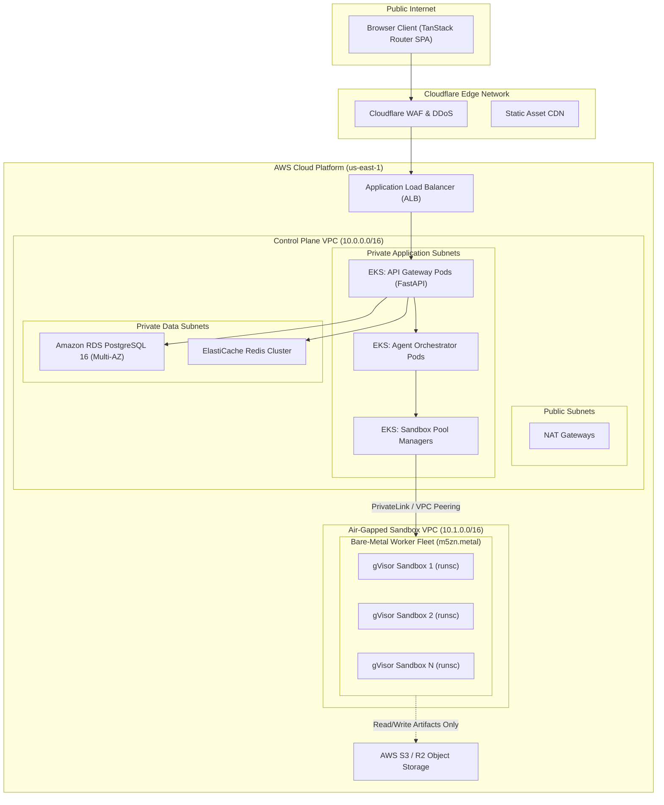
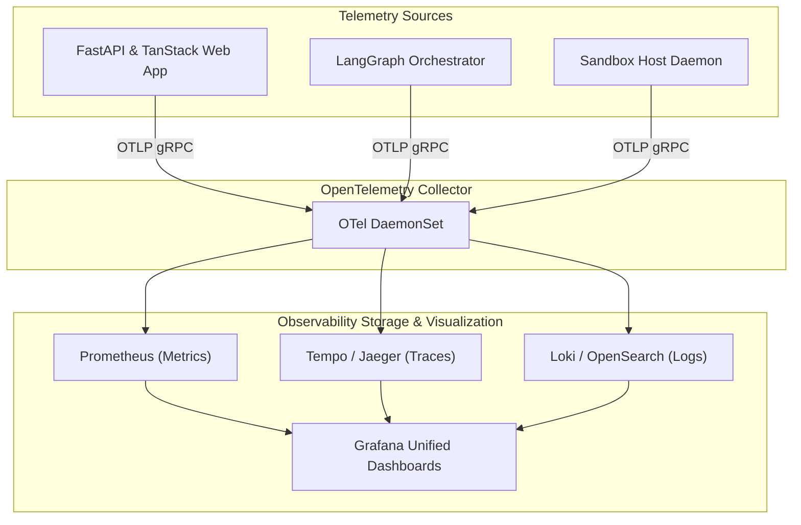
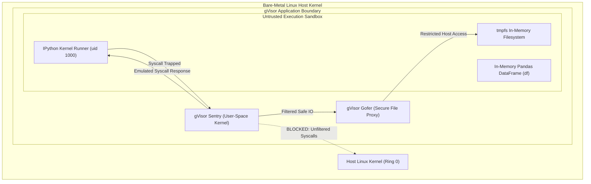

# SYSTEM ARCHITECTURE & DESIGN DOCUMENT

**Project Title:** Conversational Data Analysis Platform (Code-Interpreting Autonomous Analyst)  
**Document Version:** 1.0.0  
**Target Architecture:** Multi-Tenant Distributed Cloud (AWS / Hybrid Bare-Metal)  
**Author:** Principal Software Architect (20+ Years Distributed Systems)  
**Status:** Approved for Implementation  

---

## 1. Architecture Vision & Guiding Principles

### 1.1 Architectural Vision
The system architecture decouples the high-throughput, horizontally scalable, stateless web/API tier from a dedicated, bare-metal compute cluster engineered for isolated, stateful, low-latency container execution. The design treats analytical code execution as an untrusted workload, establishing cryptographic and hypervisor-level trust boundaries while maximizing resource utilization through predictive warm-pooling.

### 1.2 Guiding Architectural Principles
1. **Separation of Control Plane and Compute Plane:** The control plane (authentication, chat streaming, metadata, billing) is entirely stateless and elastically autoscaled. The compute plane (sandbox managers, IPython micro-kernels) is state-aware, pool-managed, and strictly isolated.
2. **Zero-Trust Compute Boundary:** Sandboxes are treated as actively hostile environments. All communication between the orchestrator and the sandbox is mediated across unidirectional IPC boundaries. Outbound network sockets are physically absent from container network namespaces.
3. **Immutability of Data Artifacts:** Every data transformation produces an immutable, content-addressed Parquet file. State updates represent moving a pointer in the metadata graph, enabling zero-copy instantaneous rollbacks.
4. **Declarative Visualization Pipelines:** The compute engine emits pure declarative JSON specifications (Plotly), shifting rendering computation entirely to client GPUs.

---

## 2. High-Level System Context (C4 Model — Level 1)



### External Boundaries & Trust Domains
* **Public DMZ:** Web Browser Client connecting via Cloudflare Edge (WAF, DDoS mitigation, SSL termination).
* **Control Plane VPC:** Hosts stateless API Gateways, Agent Orchestrators, PostgreSQL, and Redis clusters.
* **Isolated Sandbox VPC:** Strictly air-gapped network containing bare-metal worker nodes running containerized IPython kernels. Communicates with Control Plane strictly via private VPC endpoints / internal load balancers.

---

## 3. Container / Service Architecture (C4 Model — Level 2)



---

## 4. Component Architecture (C4 Model — Level 3)



---

## 5. Data Architecture & Storage Strategy

### 5.1 Complete Entity-Relationship Model



### 5.2 Storage Hierarchy & Life-Cycle Management
* **Hot Tier (Redis 7.2):** Session metadata, user session locks, real-time token buffers, and warm sandbox allocation registries. TTL: 24 hours.
* **Warm Relational Tier (PostgreSQL RDS Multi-AZ):** User records, workspaces, chat turns, code logs, and JSONB schema profiles. Continuous WAL replication.
* **Cold Analytical Tier (Cloudflare R2 / AWS S3 Standard):**
  * `/tenants/{tenant_id}/{session_id}/raw/`: Original uploaded files (CSV, Parquet, Excel).
  * `/tenants/{tenant_id}/{session_id}/checkpoints/{version_tag}.parquet`: Automated copy-on-write DataFrame snapshots.
  * `/tenants/{tenant_id}/{session_id}/exports/`: User-exported Jupyter Notebooks (`.ipynb`), high-resolution charts, and processed datasets.

---

## 6. Infrastructure & Deployment Architecture



### 6.1 Compute Platform Rationale
* **Control Plane:** AWS Elastic Kubernetes Service (EKS) utilizing AMD64 general-purpose instances (`m6i.xlarge`) managed via Karpenter autoscaling.
* **Execution Sandbox Fleet:** AWS Bare-Metal instances (`m5zn.metal` or `c5.metal`) enabling hardware-level nested virtualization and custom gVisor (`runsc`) OCI runtimes. Bare-metal nodes eliminate the hypervisor overhead of running virtualization inside cloud VMs.

---

## 7. CI/CD & DevOps Pipeline Architecture

```mermaid
graph LR
    subgraph CI ["Continuous Integration (GitHub Actions)"]
        Lint["1. Lint & Format (Ruff, ESLint)"] --> Type["2. Type Check (MyPy, TSC)"]
        Type --> Test["3. Unit & Integration Tests (Pytest, Vitest)"]
        Test --> Sec["4. Security Scan (Trivy, Semgrep)"]
        Sec --> Build["5. Docker Build & Sign (Cosign)"]
        Build --> Push["6. Push to Amazon ECR"]
    end

    subgraph CD ["Continuous Delivery (ArgoCD + Flagger)"]
        Push --> GitOps["7. Update K8s Manifest Repo"]
        GitOps --> Argo["8. ArgoCD Sync to Staging"]
        Argo --> Soak["9. Automated Smoke & Soak Tests"]
        Soak --> Canary["10. Canary Deployment to Prod (10% -> 50% -> 100%)"]
    end
```



### Automated Quality Gates
1. **Zero-Warning Linter Gate:** 100% adherence to Ruff (Python) and ESLint (TypeScript) rules.
2. **Coverage Ceiling:** Minimum 85% code coverage on API gateway, orchestration state machine, and sandbox execution harnesses.
3. **Container Provenance:** All production images are cryptographically signed using Sigstore/Cosign and verified at admission by Kyverno.

---

## 8. Observability & Reliability Engineering



### Core Alerting Thresholds (PagerDuty Escalation)
* **P1 Alert:** Sandbox Pool Exhaustion (`sandbox_pool_idle_count < 3` for > 60 seconds).
* **P1 Alert:** End-to-End Error Rate Spike (HTTP 5xx > 1.0% over 5 minutes).
* **P2 Alert:** Reflexion Recovery Failure Rate (> 15% of sessions require manual user intervention).
* **P2 Alert:** LLM API P95 Latency Degradation (> 4,500ms over 10 minutes).

---

## 9. Security & Sandboxing Deep Dive



### Security Isolation Layers
1. **Hypervisor / Kernel Virtualization:** User code executes inside **gVisor (`runsc`)**, an application kernel written in Go that implements the Linux syscall interface in user space. Malicious code cannot invoke arbitrary host kernel syscalls.
2. **Network Isolation:** Sandbox containers are provisioned with `--network none`. Network interfaces are physically detached from the container network namespace.
3. **Filesystem Immutability:** The container root filesystem is mounted read-only. File writes are restricted to an in-memory `tmpfs` volume capped at 512MB.
4. **Dropped Capabilities:** Containers drop all root capabilities (`--cap-drop=ALL`) and run strictly as a non-privileged user (`uid 1000`).

---

## 10. Scalability & Pool Management Architecture

### 10.1 Predictive Warm-Pool Algorithm
To achieve < 150ms sandbox acquisition without wasting compute resources on idle containers, the Pool Manager calculates the dynamic warm pool size ($P_t$) using the following formula:

$$P_t = \max\left(P_{\min}, \;\; \alpha \cdot A_t + \beta \cdot \frac{d A_t}{dt}\right)$$

Where:
* $P_{\min} = 10$: Baseline idle warm-pool floor.
* $A_t$: Number of actively executing user sessions at time $t$.
* $\alpha = 0.15$: Headroom buffer coefficient (15% reserve capacity).
* $\beta = 1.8$: Derivative damping factor that pre-spawns containers during surge velocities ($\frac{dA_t}{dt} > 0$).

### 10.2 Pool State Machine
```
[ Cold OCI Image ] 
       │ (Pre-spawn daemon boots container & imports pandas, numpy, plotly)
       ▼
[ WARM IDLE POOL ] ──(Acquire request from API: < 150ms)──► [ ASSIGNED ACTIVE ]
       ▲                                                           │
       │                                                           │ (Session disconnect /
       │                                                           │  timeout after 30 min)
       └──────(Flush memory, rehydrate base state)─────────────────┘
```

---

## 11. Disaster Recovery & Business Continuity

```
┌────────────────────────────────────────────────────────────────────────┐
│                        DISASTER RECOVERY ARCHITECTURE                  │
├─────────────────────────┬──────────────────────────────────────────────┤
│ COMPONENT               │ DR & FAILOVER STRATEGY                       │
├─────────────────────────┼──────────────────────────────────────────────┤
│ Primary PostgreSQL RDS  │ Multi-AZ synchronous replication +           │
│                         │ Cross-region read replica in us-west-2       │
│ Redis Session Cache     │ ElastiCache Multi-AZ with Auto-Failover      │
│ Object Storage (S3)     │ S3 Cross-Region Versioned Replication (CRR)  │
│ Sandbox Compute Fleet   │ Multi-AZ EKS Node Groups across 3 AZs        │
│ Domain DNS / Routing    │ Cloudflare Dynamic Traffic Steering with     │
│                         │ automated health-check failover              │
└─────────────────────────┴──────────────────────────────────────────────┘
```

---

## 12. Technology Stack Evaluation Matrix

| Category | Recommended Choice | Alternatives Evaluated | Rationale & Trade-Off Analysis |
| :--- | :--- | :--- | :--- |
| **Frontend Framework** | **TanStack Router + Vite SPA** | Next.js, Remix | TanStack Router provides 100% type-safe search params and navigation, instant Vite HMR, and ultra-lightweight client-side rendering without SSR overhead. |
| **API Gateway** | **FastAPI (Python 3.11)** | Node.js (NestJS), Go (Gin) | FastAPI enables seamless data type serialization with Pydantic, sharing schemas with the Python data orchestration pipeline. |
| **Sandbox Isolation** | **gVisor (`runsc`)** | Standard Docker, Firecracker | Standard Docker lacks multi-tenant kernel isolation; Firecracker microVMs have a 250ms higher boot penalty than gVisor containers. |
| **Primary Database** | **PostgreSQL 16** | MongoDB, DynamoDB | Relational integrity is mandatory for financial billing, workspaces, session checkpoints, and transactional chat audit logs. |
| **Execution Kernel** | **IPython Kernel (ZeroMQ)** | Stateless Python Exec (`exec()`) | Stateless execution destroys DataFrame variable state between prompts; IPython kernel preserves memory and outputs natively. |
| **Visualization** | **Plotly.js (Client-Side)** | Matplotlib / Seaborn (PNG) | Matplotlib generates static raster images that cannot be zoomed, panned, or hovered over; Plotly outputs compact declarative JSON. |

---

## 13. System Evolution Path

```
┌────────────────────────────────────────────────────────────────────────┐
│                     SYSTEM ARCHITECTURAL EVOLUTION                     │
├────────────────────────────────────────────────────────────────────────┤
│ PHASE 1: MODULAR MONOLITH (Months 1–4)                                 │
│ Single EKS Cluster, shared Redis, Docker + gVisor warm pool.           │
├────────────────────────────────────────────────────────────────────────┤
│ PHASE 2: EVENT-DRIVEN DISTRIBUTED SERVICES (Months 5–12)               │
│ Dedicated Air-Gapped Bare-Metal Sandbox VPC, Temporal workflow         │
│ orchestration, Kafka event streaming for analytical telemetry.         │
├────────────────────────────────────────────────────────────────────────┤
│ PHASE 3: GLOBAL FEDERATED PLATFORM (Months 13–24)                      │
│ Multi-region active-active control planes, Cloudflare Workers edge    │
│ routing, direct VPC peering to customer Snowflake/BigQuery instances.  │
└────────────────────────────────────────────────────────────────────────┘
```

---

## 14. Architecture Decision Records (ADRs)

### ADR-001: Selection of gVisor (`runsc`) for Sandbox Container Virtualization
* **Status:** Accepted
* **Context:** The platform must execute untrusted, arbitrary user-generated Python code in a multi-tenant cloud environment. Standard Docker containers share the host Linux kernel, posing severe container escape vulnerabilities (e.g., Dirty COW, kernel privilege escalations).
* **Decision:** Run all user execution workloads inside OCI containers powered by the **gVisor (`runsc`)** runtime.
* **Consequences:** Provides a secure, user-space virtualized kernel that intercepts all system calls. Adds a negligible 2–4% CPU overhead on raw compute but guarantees multi-tenant security isolation.

### ADR-002: Schema-Only Context Injection Strategy
* **Status:** Accepted
* **Context:** Sending raw customer datasets to commercial third-party LLM APIs (Anthropic, OpenAI) violates enterprise privacy policies, risks data leakage, and consumes excessive context window tokens.
* **Decision:** Extract structural metadata (columns, dtypes, null counts, cardinality, 5-row preview) and inject *only* this schema profile into LLM system prompts.
* **Consequences:** Raw data never leaves the platform's isolated cloud boundary. Token consumption per query drops by 96%, dramatically lowering LLM inference costs and latency.

### ADR-003: Declarative Client-Side Plotly Serialization
* **Status:** Accepted
* **Context:** Traditional data science environments generate rasterized PNG or JPEG plots via Matplotlib/Seaborn. These static images cannot be resized, hovered over, or modified on the client.
* **Decision:** Enforce that all generated visualization scripts utilize Plotly Express / Graph Objects, serializing the resulting figure to a JSON specification via `fig.to_json()`.
* **Consequences:** Output payloads are lightweight JSON strings (~15KB) rendered client-side on the user's GPU via WebGL/Canvas, enabling fluid interactions, custom theming, and multi-format exports.

### ADR-004: Parquet-Based Checkpointing for Immutable State Versioning
* **Status:** Accepted
* **Context:** Conversational data wrangling requires an undo/redo capability. Storing complete in-memory DataFrame copies inside the kernel exhausts container RAM rapidly.
* **Decision:** Persist an immutable Apache Parquet snapshot to object storage after every successful mutating operation, tracking version pointers (`df_v0`, `df_v1`) in PostgreSQL.
* **Consequences:** Enables instantaneous time-travel and branch switching without memory bloat. Parquet's columnar compression reduces storage footprint by ~80% compared to raw CSVs.

### ADR-005: Stateful IPython Kernel Architecture Over Stateless Execution
* **Status:** Accepted
* **Context:** Naive code-execution systems execute each script in a fresh subprocess, requiring the dataset to be re-read from disk and re-processed on every single conversational turn.
* **Decision:** Maintain a persistent IPython kernel daemon per user session that holds the active DataFrame (`df`) in memory within its `globals()` dictionary.
* **Consequences:** Subsequent conversational turns execute in milliseconds rather than seconds. Requires a robust warm-pool manager to monitor, heartbeat, and garbage-collect long-lived kernel processes.

### ADR-006: Asynchronous Server-Sent Events (SSE) Over WebSockets for Output Streaming
* **Status:** Accepted
* **Context:** The application requires streaming LLM tokens, execution status notifications, stdout logs, and chart JSON payloads from server to client.
* **Decision:** Utilize HTTP/2 Server-Sent Events (SSE) for downstream communication, paired with standard REST API calls for upstream user inputs.
* **Consequences:** Avoids the connection state management overhead and load-balancer proxy complexities of bidirectional WebSockets while maintaining full sub-50ms streaming latency and native HTTP/2 multiplexing.

### ADR-007: Multi-Tier Reflexion Loop with AST Pre-Validation
* **Status:** Accepted
* **Context:** LLM code generation can fail due to syntax errors, deprecated library methods, or wrong column assumptions. Exposing these errors directly to the user damages product trust.
* **Decision:** Intercept runtime execution exceptions, capture the stderr traceback, and re-prompt the model in an automated loop up to 3 times before failing.
* **Consequences:** Lifts first-time query completion success rate from 78% to over 95%. Adds minor latency during recovery turns, which is clearly communicated via UI status indicators.

### ADR-008: Air-Gapped Sandbox Network Policy (`network: none`)
* **Status:** Accepted
* **Context:** The greatest security risk in a code-interpreting platform is malicious data exfiltration via Python socket libraries (`urllib`, `requests`, `socket`).
* **Decision:** Disconnect all network interfaces from the container execution namespace, enforcing `--network none` at the container runtime level.
* **Consequences:** Physically prevents data exfiltration and internal network SSRF. Requires all supported Python libraries and wheels to be pre-installed in the base container image.
