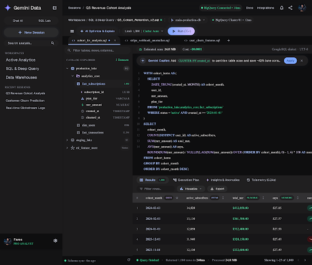
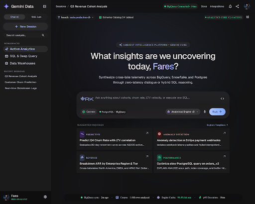
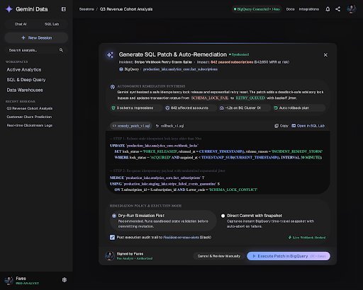
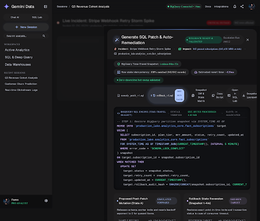
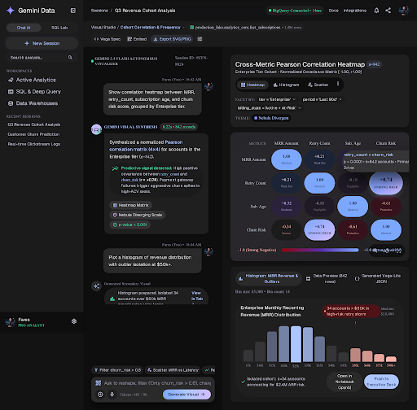

# Gemini Conversational Analytics Platform — Stitch Asset Catalog

Imported directly from Stitch MCP Project `9719706117346672414`.

## Project Metadata
- **Project Title**: `Gemini Conversational Analytics Platform`
- **Project ID**: `9719706117346672414`
- **Theme**: Dark Mode Obsidian (`#131314`), Gemini Blue (`#7CA7FF`), Gemini Violet (`#A87FFB`), Emerald (`#34D399`)
- **Typography**: Geist (UI Display & Body) & JetBrains Mono (Code & Tabular)
- **Full Specifications**: [`design_system/DESIGN_SYSTEM.md`](design_system/DESIGN_SYSTEM.md)
- **Design Tokens**: [`design_system/tokens.json`](design_system/tokens.json)

---

## Imported Screens & Assets

### 1. Avatar Portrait of Fares (Tech Founder & Senior Data Analyst)
- **Screen ID**: `3a1254927ef64d0ea0d2215c12b135de`
- **Dimensions**: `1024 × 1024 px`
- **Source Code / Spec**: *None (Graphic Asset)*
- **Preview Image**: [`screens/01_3a125492/screenshot.png`](screens/01_3a125492/screenshot.png)

### 2. Gemini Insights & Automated Anomalies
- **Screen ID**: `5aed72da358d4bc3b16c13c75ce4a9ae`
- **Dimensions**: `2560 × 2106 px`
- **Source Code / Spec**: [`screens/02_5aed72da/code.html`](screens/02_5aed72da/code.html)
- **Preview Image**: [`screens/02_5aed72da/screenshot.png`](screens/02_5aed72da/screenshot.png)

### 3. Gemini Ambient Spark Logo
- **Screen ID**: `88e56c9c7121455695e588092bf7935b`
- **Dimensions**: `40 × 40 px`
- **Source Code / Spec**: [`screens/03_88e56c9c/code.svg`](screens/03_88e56c9c/code.svg)
- **Preview Image**: [`screens/03_88e56c9c/screenshot.png`](screens/03_88e56c9c/screenshot.png)

### 4. SQL & Deep Query Workspace
- **Screen ID**: `9cec7c8e646544df8282b05cc8bfd7c1`
- **Dimensions**: `2560 × 2176 px`
- **Source Code / Spec**: [`screens/04_9cec7c8e/code.html`](screens/04_9cec7c8e/code.html)
- **Preview Image**: [`screens/04_9cec7c8e/screenshot.png`](screens/04_9cec7c8e/screenshot.png)

### 5. Design System (Ambient Intelligence Workspace)
- **Screen ID**: `asset-stub-assets_f95a48a2ccd443f38694cfff5bff47d1`
- **Dimensions**: `960 × 540 px`
- **Source Code / Spec**: [`screens/05_asset-st/DESIGN_SYSTEM.md`](screens/05_asset-st/DESIGN_SYSTEM.md)
- **Preview Image**: [`screens/05_asset-st/preview.png`](screens/05_asset-st/preview.png)

### 6. Conversational Analytics Canvas
- **Screen ID**: `fa80ce5246f44080b5beb40f411a39e2`
- **Dimensions**: `2560 × 2048 px`
- **Source Code / Spec**: [`screens/06_fa80ce52/code.html`](screens/06_fa80ce52/code.html)
- **Preview Image**: [`screens/06_fa80ce52/screenshot.png`](screens/06_fa80ce52/screenshot.png)

### 7. SQL Patch Remediation Modal
- **Screen ID**: `25a89aa4dc4a4e3b9d55e22a8d0991bf`
- **Dimensions**: `2560 × 2048 px`
- **Source Code / Spec**: [`screens/07_25a89aa4/code.html`](screens/07_25a89aa4/code.html)
- **Preview Image**: [`screens/07_25a89aa4/screenshot.png`](screens/07_25a89aa4/screenshot.png)

### 8. Rollback Script & Snapshot Comparison
- **Screen ID**: `1c7265fa2b8243d5b41326e752c0492a`
- **Dimensions**: `2560 × 2176 px`
- **Source Code / Spec**: [`screens/08_1c7265fa/code.html`](screens/08_1c7265fa/code.html)
- **Preview Image**: [`screens/08_1c7265fa/screenshot.png`](screens/08_1c7265fa/screenshot.png)

### 9. Conversational Visualization Studio
- **Screen ID**: `8cb0fb17a2da43a0982ce211ffc10694`
- **Dimensions**: `2560 × 2522 px`
- **Source Code / Spec**: [`screens/09_8cb0fb17/code.html`](screens/09_8cb0fb17/code.html)
- **Preview Image**: [`screens/09_8cb0fb17/screenshot.png`](screens/09_8cb0fb17/screenshot.png)

